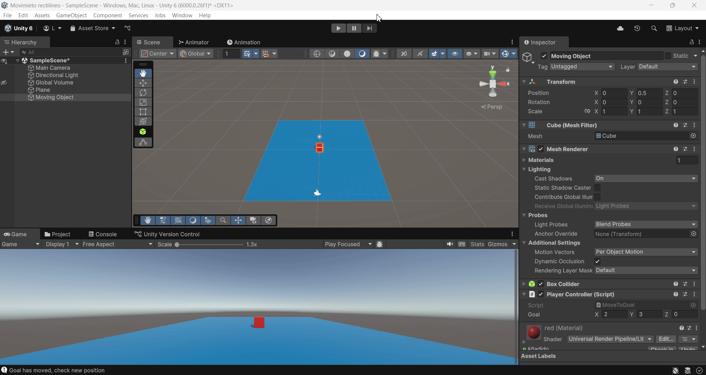
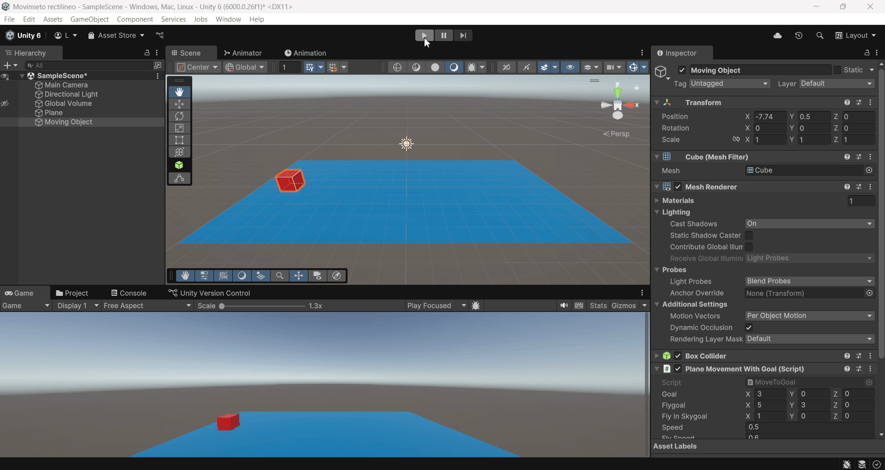
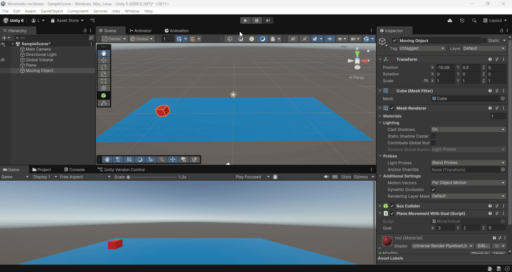
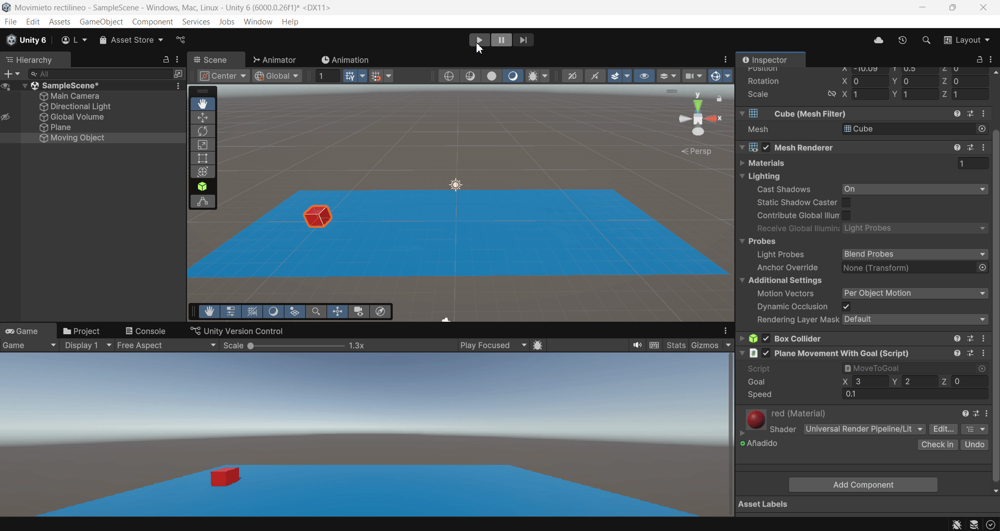
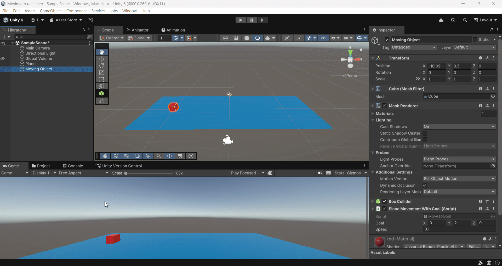
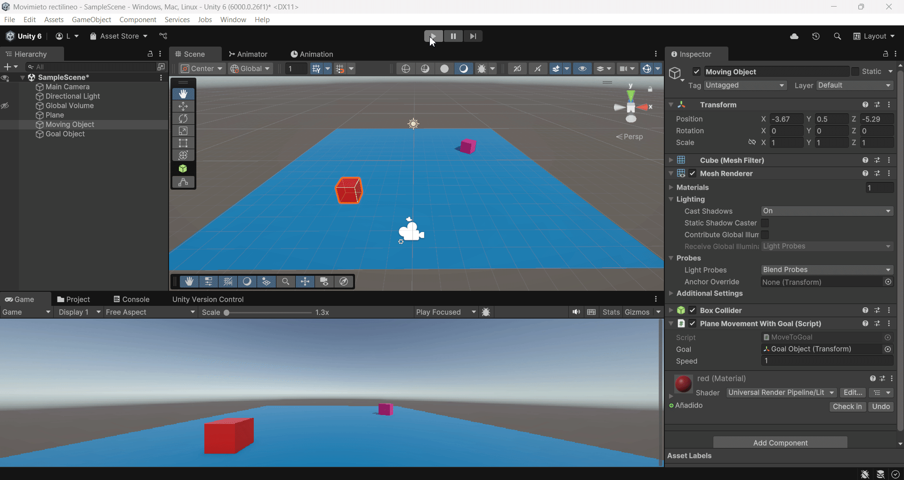

# FDV_Movimiento_rectilineo

```
>>  PRACTICA:   Unity Project Script 1 - Movimiento rectilíneo
>>  COMPONENTE: XueMei Lin
>>  GITHUB:     https://github.com/XueMei-L/FDV_Movimiento_rectilineo.git
```

## 1. Crear un script que mueva el objeto hacia un punto fijo que se marque como objetivo utilizando el método Translate de la clase Transform. El objetivo debe ser una variable pública, de esta forma conseguimos manipularla en el inspector y ver el efecto de distintos valores en las coordenadas. Utilizar this.transform.Translate(goal) en el start, solo se mueve una vez.

1. Crear un proyecto de 3D, tambien hay que crear un plano y un cubo para realizar el movimiento.
2. Seleccionar el cubo, cambiar su nombre a **"MovingObject"**.
3. En la ventana de ***Project*** crear un Script llamado **"MoveToGoal_01"** para manejar el movimiento del cubo
4. Script de **MoveToGoal_01**:
    ```
    using UnityEngine;

    public class PlayerController : MonoBehaviour
    {
        // create a moving object
        public Vector3 goal = new Vector3(0, 0, 0);
        
        // start function
        void Start()
        {
            // move goal using transform.Traslate
            this.transform.Translate(goal);
            Debug.Log("Goal has moved, check new position");
        }
    }
    ```
5. Inicialmente el cubo en la posición (0,0,0), si cambia la posición en la ventana de inspector, y dar test, el objecto se mueve a la posicion indicada.

6. Obtiene el siguiente resultado:
    

### a) Añadir this.transform.Translate(goal); al Update e ir multiplicando goal = goal * 0.5f; en el start para dar saltos más pequeños cada vez.
1. Modificar el script **MoveToGoal_01**
    ```
    using UnityEngine;

    public class PlayerController : MonoBehaviour
    {
        public Vector3 goal = new Vector3(0, 0, 0);
        
        void Update()
        {
            // disminuir el paso de movimiento
            goal = goal * 0.5f;
            
            // move goal
            this.transform.Translate(goal);
            Debug.Log("Goal has moved, check new position");
        }
    }

    ```
Ahora el objeto continuará moviéndose, pero cada vez se moverá la mitad de la distancia del objetivo original.

2. Indica la posición (2, 2, 0)
    

3. Resultado: se puede ver que el objecto se mueve con paso pequeño 
    

### b) Configurar la coordenada Y del Objetivo en 0.
1. Modificar la coordena Y.
    

2. Resultado: el objeto mueve horizontalmente 
    

### c) Poner al Objetivo una coordenada Y distinta de cero.
1. Modificar la coordena Y distinta de cero.


2. Resultado: el objeto mueve como antes (caso a)



### d) Modificar el script para que el objeto despegue del suelo y vuele como un avión.
1. Modificar el script **MoveToGoal_01**:
    ```
    using UnityEngine;

    public class PlaneMovementWithGoal : MonoBehaviour
    {
        public Vector3 goal = new Vector3(3,0,0);
        public Vector3 flygoal = new Vector3(5,3,0);
        public Vector3 flyInSkygoal = new Vector3(1, 0, 0);
        
        public float speed = 0.5f;
        public float flySpeed = 0.3f;

        private float timer = 0f;

        void Update()
        {
            // to count timer
            timer += Time.deltaTime;

            goal = goal * 0.5f;
            flygoal = flygoal * 0.5f;
            flyInSkygoal = flyInSkygoal * 0.5f;

            if(timer < 2f)
            {
                this.transform.Translate(goal * speed * Time.deltaTime);  // * Time.deltaTime is for the speed
            } else if(timer > 2f && timer < 4f) {
                this.transform.Translate(flygoal * flySpeed * Time.deltaTime);
            } else {
                this.transform.Translate(flyInSkygoal * flySpeed * Time.deltaTime);
            }
        }
    }
    ```
2. Modificar las coordenadas.


1. Resultado: para simular como un avión, se realiza primero preparar para volar, y durante el proceso de volar, y volar en el cielo. Dependiendo del proceso, se modifica la velocidad.


## e) Duplicar los valores de X, Y, Z del Objetivo. ¿Es consistente el movimiento?.
En mi caso si es consistente, puesto que he añadido multiplicar por Time.deltaTime, eso significa que utiliza movimiento independiente de la velocidad de cuadros. Sino no es consistente, porque duplicar las coordenadas, tambien duplicarán la velocidad y la distancia de movimiento.


## 2. El Objetivo no es un objetivo propiamente dicho, sino una dirección en la que queremos movernos. La información relevante de un vector es la dirección. Los vectores normalizados, conservan la misma dirección pero su escala no afecta al movimiento. Se debe conseguir un movimiento consistente de forma que la escala no afecte a la traslación. Del mismo modo, se debe conseguir que el recorrido realizado por el personaje entre un frame y otro no tenga aberraciones espacio-temporales. Para ello se debe considerar la relación entre la velocidad, el espacio y el tiempo. Por otra parte, el tiempo que transcurre entre un frame y otro se obtiene con: Time.deltaTime. 

En este ejercicio se pretende dotar de esa consistencia al movimiento que hacer el personaje para ello:

### a) Sustituir la dirección del movimiento por su equivalente normalizada. Esto se consigue con el método normalized de la clase Vector3: this.transform.Translate(goal.normalized);
1. Nuevo script de **MoveToGoal_02**:
    ```
    using UnityEngine;

    public class PlaneMovementWithGoal : MonoBehaviour
    {
        public Vector3 goal = new Vector3(0,0,0);

        void Update()
        {
            // Use the normalized direction vector
            this.transform.Translate(goal.normalized);
        }
    }
    ```
2. utiliza goal.normalized para normalizar el vector de dirección.
3. Resultado:


### b) Con el vector normalizado, lo podemos multiplicar por un valor de velocidad para determinar cómo de rápido va el personaje. public float speed = 0.1f this.transform.Translate(goal.normalized*speed)
1. Modificar **MoveToGoal_02**:
    ```
    using UnityEngine;

    public class PlaneMovementWithGoal : MonoBehaviour
    {
        public Vector3 goal = new Vector3(0,0,0);
        public float speed = 0.1f;

        void Update()
        {
            // Use the normalized direction vector
            this.transform.Translate(goal.normalized*speed);
        }
    }
    ```
2. con el speed = 0.1f, ahora el cubo mueve hacia una dirección más consistente y lenta.
3. Resultado:


### c) A pesar de que esas velocidades puedan parecer ahora que son consistentes, no lo son, porque dependen de la velocidad a la que se produzca el update. El tiempo entre dos updates no es necesariamente siempre el mismo, con lo que se pueden tener inconsistencias en la velocidad, y a pesar de que en aplicaciones con poca complejidad no lo notemos, se debe usar: this.transform.Translate(goal.normalized * speed * Time.deltaTime); para suavizar el movimiento ya que Time.deltaTime es el tiempo que ha pasado desde el último frame. 

1. Modificar el script **MoveToGoal_03**
   ```
   using UnityEngine;

    public class PlaneMovementWithGoal : MonoBehaviour
    {
        public Vector3 goal = new Vector3(0,0,0);
        public float speed = 0.1f;

        void Update()
        {
            // Use the normalized direction vector
            this.transform.Translate(goal.normalized * speed * Time.deltaTime);
        }
    }
   ```
2. utilizar Time.deltaTime y normalized hace que ahora el movimiento sea suave y consistente.
3. Resultado:


## 3. En lugar de seguir usando una dirección como objetivo, vamos a movernos ahora hacia una verdadera posición objetivo. Lo agregarermos como un campo público en la clase para poder configurarlo desde le Inspector. También agregaremos un campo para configurar la velocidad del personaje desde el propio Inspector. Aunque queramos desplazarnos hacia un punto en el espacio, el método Translate debe recibir la dirección del movimiento. La dirección que une dos puntos se obtiene restando el más lejano al más cercano. Por último, si el personaje no está encarando el objetivo (podría incluso estar de espaldas a él), el desplazamiento será suave pero la orientación de su malla no será consistente. Por esta razón será necesario rotarlo de forma que su eje z local (forward) apunte hacia el objetivo. La función LookAt del Transform nos ayudará con esto. En este caso, por tanto, para movernos hacia un punto en el espacio que configuramos a una velocidad dada: 

### a) Hacemos el objetivo una variable pública public Transform goal y añadimos un *public float speed = 1.0f*.

### b) Giramos al personaje para lograr que su movimiento sea hacia delante utilizando *this.transform.LookAt(goal.position)* en el Start para que gire primero y luego se mueva.

### c) La dirección en la que nos tenemos que mover viene determinada por la diferencia entre la posición del objetivo y nuestra posición: *Vector3 direction = goal.position - this.transform.position;* *this.transform.Translate(direction.normalized * speed * Time.deltaTime)*

### d) Si lo ejecutamos en este momento, como la orientación del personaje va a cambiar, el translate no va a funcionar correctamente porque los ejes del personaje y el mundo no están alineados. El movimiento se debe hacer de forma relativa al sistema de referencia del mundo.*this.transform.Translate(direction.normalized * speed * Time.deltaTime, Space.World).*

**Script completo de MoveToGoal_04:**
```
using UnityEngine;

public class PlaneMovementWithGoal : MonoBehaviour
{
    // Campos públicos configurables desde el Inspector
    public Transform goal;  // Objetivo al que nos moveremos
    public float speed = 1.0f;  // Velocidad de movimiento
    void Start()
    {
        // Primero giramos el personaje para que mire al objetivo
        this.transform.LookAt(goal.position);
        Debug.Log("Posición inicial del objetivo: " + goal.position);
    }

    void Update()
    {
        // Calculamos la dirección hacia el objetivo
        Vector3 direction = goal.position - this.transform.position;
        Debug.Log("goal.position:" + goal.position);
        Debug.Log("this.transform.position:" + this.transform.position);
        
        // Normalizamos el vector dirección (magnitud = 1) y aplicamos velocidad y tiempo
        // Movemos al personaje en coordenadas globales (Space.World)
        this.transform.Translate(
            direction.normalized * speed * Time.deltaTime, 
            Space.World
        );
    }
}
```

Resultado: se puede ver en el gif, que primero el objeto rojo gira hacia el objeto destino rosa, y luego mueve con una velocidad consistente hacia el objeto destino.


## 4. Añadir Debug.DrawRay(this.transform.position,direction,Color.red) para depuración para comprobar que la dirección está correctamente calculada. 
```
using UnityEngine;

public class PlaneMovementWithGoal : MonoBehaviour
{
    public Transform goal;
    public float speed = 1.0f;
    void Start()
    {
        // Primero giramos el personaje para que mire al objetivo
        this.transform.LookAt(goal.position);
        Debug.Log("Posición inicial del objetivo: " + goal.position);
    }

    void Update()
    {
        // Calculamos la dirección hacia el objetivo
        Vector3 direction = goal.position - this.transform.position;
        Debug.Log("goal.position:" + goal.position);
        Debug.Log("this.transform.position:" + this.transform.position);
        
        // Normalizamos el vector dirección (magnitud = 1) y aplicamos velocidad y tiempo
        // Movemos al personaje en coordenadas globales (Space.World)
        this.transform.Translate(
            direction.normalized * speed * Time.deltaTime, 
            Space.World
        );

        // mostrar la dirección
        Debug.DrawRay(this.transform.position,direction,Color.red);
    }
}
```

Resultado: 


## 5. Agregar un cubo en la escena que hará de objetivo, que debe ser movido usando el controlador de los Starter Assets. Sobre la escena que has trabajado ubica un personaje que va a seguir al cubo. 
1. añadir un cubo, asignar el controlador de los Starter Assets: **Character Controller**, **Player Input**, **Third Person Controller**, **Starter Assets Inputs** para conseguir que se mueve el cubo.

2. Crear otro objeto "personaje", en este caso, usa el cubo como personaje.

### a)Crear un script que haga que el personaje siga al cubo continuamente sin aplicar simulación física.
1. usa el script **MoveToGoal_05** para conseguir que el personaje, cubo rojo siga el cubo amarillo continuamente.
```
using UnityEngine;

public class PlaneMovementWithGoal : MonoBehaviour
{
    public Transform goal;
    public float speed = 1.0f;
    void Start()
    {
        // Primero giramos el personaje para que mire al objetivo
        this.transform.LookAt(goal.position);
    }

    void Update()
    {
        // Calculamos la dirección hacia el objetivo
        Vector3 direction = goal.position - this.transform.position;
        
        // Normalizamos el vector dirección (magnitud = 1) y aplicamos velocidad y tiempo
        // Movemos al personaje en coordenadas globales (Space.World)
        this.transform.Translate(
            direction.normalized * speed * Time.deltaTime, 
            Space.World
        );

        // mostrar la dirección
        Debug.DrawRay(this.transform.position,direction,Color.red);
    }
}
```
2. Resultado: se ve en el gif, el cubo(personaje) rojo está siguiendo el cubo amarillo.


### b)Agregar un campo público que permita graduar la velocidad del movimiento desde el inspector de objetos.
1. Agregar un campo público de velocidad.


### c)Utilizar la tecla de espaciado para incrementar la velocidad del desplazamiento en el tiempo de juego.
1. Añadir la velocidad basica, y velocidad a incrementar. cuando presiona espacio, se detecta y incrementa la velocidad.
```
using UnityEngine;

public class PlaneMovementWithGoal : MonoBehaviour
{
    public Transform goal;
    public float baseSpeed = 1.0f;
    public float speedIncrement = 1.0f;
    private float _currentSpeed;

    public KeyCode boostKey = KeyCode.Space;
    void Start()
    {
        // asignar la velocidad actual como velocidad inicial.
        _currentSpeed = baseSpeed;
        // Primero giramos el personaje para que mire al objetivo
        this.transform.LookAt(goal.position);
    }

    void Update()
    {
        if (Input.GetKeyDown(KeyCode.Space))
        {
            _currentSpeed += speedIncrement;
        }
        // Calculamos la dirección hacia el objetivo
        Vector3 direction = goal.position - this.transform.position;
        
        // Normalizamos el vector dirección (magnitud = 1) y aplicamos velocidad y tiempo
        // Movemos al personaje en coordenadas globales (Space.World)
        this.transform.Translate(
            direction.normalized * _currentSpeed * Time.deltaTime, 
            Space.World
        );

        // mostrar la dirección
        Debug.DrawRay(this.transform.position,direction,Color.red);
    }
    public void ResetSpeed()
    {
        _currentSpeed = baseSpeed;
    }
}
```

2. Resultado: se puede ve que cada vez el cubo rojo (personaje) va más rápido siguiendo el cubo amarillo.


## 6.En esta sesión se trabaja el Movimiento rectilíneo hacia el objetivo haciendo avanzar al personaje siempre en línea recta hacia adelante.  Para ello, el personaje debe rotar hacia el objetivo y luego avanzar en la dirección foward. En este caso hay  que destacar que el método Translate de la clase Transform tiene dos formas de realizar la traslación. Esto lo podemos resolver rotando al personaje hacia su objetivo (LookAt) y trasladándolo en el eje forward, respecto al sistema de referencia local, lo que corresponde al valor por defecto del parámetro de Translate: relativeTo

```
//Move the object forward along its z axis 1 unit/second.
   transform.Translate(Vector3.forward * Time.deltaTime);
```
## Sin embargo, imagina que el personaje está dentro de un vehículo que también se está moviendo. Si solo avanzamos en el eje Z local, el personaje se moverá hacia adelante en relación al vehículo, pero no necesariamente hacia el objetivo en el mundo. Para resolver esto lo que debemos hacer es movernos en la dirección correcta con respecto a sistema de referencia mundial, que corresponde al valor Space.World del parámetro relativeTo de la clase Transform. En este ejercicio experimentamos con estas cuestiones:

### a) Realizar un script que gire al personaje hacia su objetivo para llegar hasta él desplazándose sobre su vector forward local.
1. Modificar el **MoveToGoal_06**, hace que el objeto seguido está mirando hacia el objeto destino.
   
```
using UnityEngine;

public class PlaneMovementWithGoal : MonoBehaviour
{
    public Transform goal;
    public float baseSpeed = 1.0f;

    void Start()
    {
        this.transform.LookAt(goal.position);
    }

    void Update()
    {
        // Mirar hacia el objeto destino
        this.transform.LookAt(goal.position);

        // Move the object forward along its z axis 1 unit/second.
        // Movimiento en forward local (sin Space.World)
        this.transform.Translate(
            Vector3.forward * baseSpeed * Time.deltaTime);
    }
}
```

2. Vector.forward = Vector3(0, 0, 1), Indica la dirección frontal (eje Z) del sistema de coordenadas local del objeto. 

### b)Realizar un script que gire al personaje y lo desplace hacia su objetivo sobre la dirección que lo une con su objetivo. Normarlizar la dirección para evitar la influencia de la magnitud del vector
1. Modificamos el código
   ```
   this.transform.Translate(
            Vector3.forward.normalized * baseSpeed * Time.deltaTime);
   ```

### c) Realizar un script que gire al personaje y lo desplace hacia su objetivo en la dirección que lo une con él, respecto al sistema de referencia mundial. Normarlizar la dirección para evitar la influencia de la magnitud del vector.
1. Modifcamos el código para que sea respecto al sistema de referencia mundial.
   ```
   transform.Translate(
            direccion * baseSpeed * Time.deltaTime, 
            Space.World
        );
   ```

2. Resultado final:


## 7. Cuando ejecutamos el script, el personaje calcula la dirección hacia el objetivo y se mueve hacia él, pero no puede dejar de moverse y se produce jittering. La razón es que todavía estamos dentro del bucle, calculando la dirección y moviéndonos hacia él. En la mayoría de los casos no vamos a conseguir que nuestro personaje se mueva a la posición exacta del objetivo, con lo que continuamente oscila en torno a esa posición. Por eso, debemos tener algún cálculo del tipo de rango de tolerancia. Incluimos una variable global pública, public float accuracy = 0.01f; y una condición if(direction.magnitude > accuracy). Aún con el accuracy, el personaje puede hacer jitter si la velocidad es muy alta.


### a) Controlar el jittering utilizando la magnitud de la dirección.

### b) Dado que la dirección nos la da la separación entre el objetivo y el personaje, también podemos controlar el jittering utilizando la distancia entre los dos puntos.
